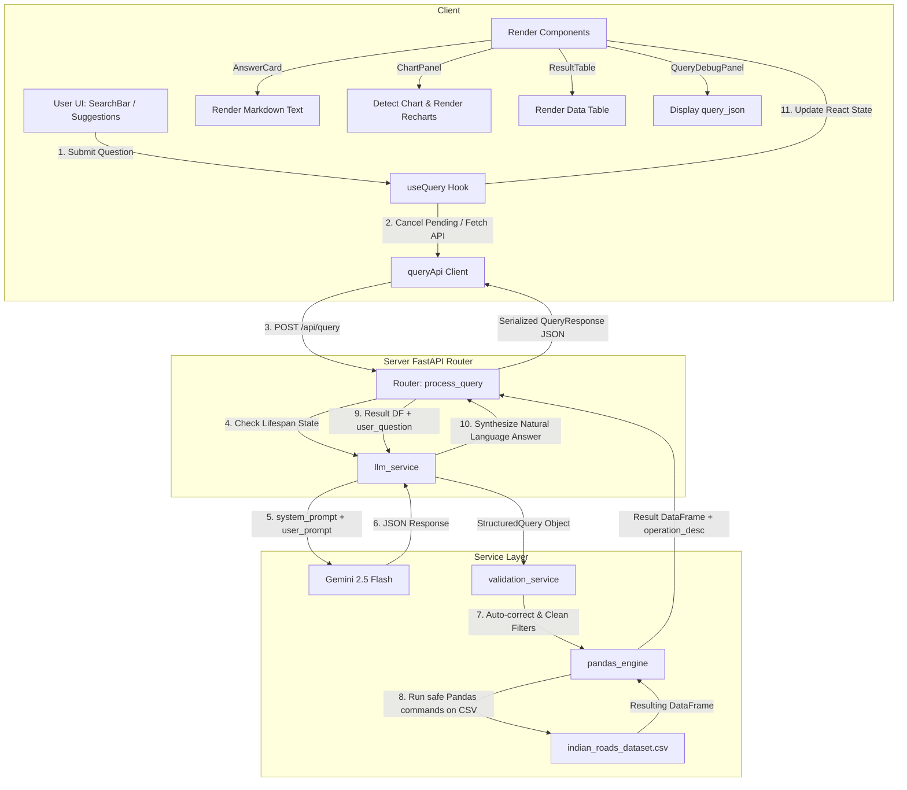

# Neural City - Indian Road Accident Analytics

[](https://react.dev/)
[](https://fastapi.tiangolo.com/)
[](https://pandas.pydata.org/)
[](https://deepmind.google/technologies/gemini/)
[](https://www.python.org/)

This project is a web-based data science platform that provides an AI-powered conversational analytics interface for the Indian Road Accident Dataset (2022-2025). Users can ask questions in natural language, which are translated into structured queries, executed against a Pandas engine, and visualized dynamically on the frontend.

---

## Dataset Analysis

The system relies on a unified road accident dataset located on the server at `Server/indian_roads_dataset.csv`. The client does not maintain a separate dataset but fetches metadata dynamically to align suggestions, constraints, and valid ranges with the server.

### Schema and Column Descriptions

The dataset contains 20,002 rows and 24 columns representing accident records, environment factors, traffic conditions, infrastructure features, and engineered metrics:

| Column Name | Data Type | Description | Sample / Allowed Values |
| --- | --- | --- | --- |
| accident_id | int64 | Unique identifier for each accident record | 0, 1, 2, ... |
| city | object | Major Indian city where the accident occurred | Bangalore, Chandigarh, Chennai, Delhi, Hyderabad, Kolkata, Mumbai, Pune |
| state | object | State corresponding to the city | Delhi, Karnataka, Maharashtra, Punjab, Tamil Nadu, Telangana, West Bengal |
| latitude | float64 | Geospatial coordinate (Latitude) | 18.680827, 28.799490 |
| longitude | float64 | Geospatial coordinate (Longitude) | 73.930388, 77.049666 |
| date | object | Date of the accident (YYYY-MM-DD) | 2023-10-22, 2024-07-29 |
| time | object | Time of day when the accident occurred (HH:MM) | 5:00, 16:00 |
| hour | int64 | Extracted hour of the day (0-23) | 0, 5, 8, 13, 23 |
| day_of_week | object | Day of the week | Monday, Tuesday, Wednesday, Thursday, Friday, Saturday, Sunday |
| is_weekend | int64 | Flag indicating if the accident occurred on a weekend | 0 (Weekday), 1 (Weekend) |
| road_type | object | Infrastructure classification of the road | highway, rural, urban |
| lanes | int64 | Number of lanes on the road | 1, 2, 3, 4, 5, 6 |
| traffic_signal | int64 | Flag indicating if a traffic signal was present | 0 (No), 1 (Yes) |
| weather | object | Weather conditions at the time of the accident | clear, fog, rain |
| visibility | object | Visibility levels at the time of the accident | low, medium, high |
| temperature | int64 | Temperature in degrees Celsius | 15 to 40 |
| traffic_density | object | Traffic density levels at the location | low, medium, high |
| cause | object | Key driver or environmental factor causing the accident | distraction, drunk driving, overspeeding, poor road, weather |
| accident_severity | object | Severity outcome of the accident | fatal, major, minor |
| vehicles_involved | int64 | Number of vehicles involved in the collision | 1 to 5 |
| casualties | int64 | Number of injuries or deaths resulting from the accident | 0 to 5 |
| is_peak_hour | int64 | Flag indicating if the accident occurred during peak traffic hours | 0 (No), 1 (Yes) |
| festival | object | Contextual indicator for holiday events | Diwali, Eid, Holi, None |
| risk_score | float64 | Engineered safety risk score based on traffic, weather, and time factors | 0.0 to 1.0 |

### Dataset Characteristics and Engineered Features

1. Geospatial Coverage: Focuses on 8 major Indian cities. Latitude and longitude correspond to valid regional bounds of these locations.
2. Temporal Features: Includes extracted calendar fields (hour, day_of_week, is_weekend, is_peak_hour) to support time-series trends and peak-period analysis.
3. Environmental and Road Conditions: Features detail weather, visibility, road type, lane count, and traffic density.
4. Engineered Risk Score: A computed value between 0 and 1 indicating overall accident risk. Values closer to 1 signify higher hazard conditions (e.g., fog + low visibility + peak hour + highway).

---

## Client Architecture

The client side is a responsive single-page web application designed for analytics exploration.

### Tech Stack

- Framework: React 19 (managed via Vite)
- Styling: TailwindCSS v4 (fully customized dark-mode glassmorphic theme)
- Icons: Lucide React
- Charting: Recharts 3.8.1 (responsive, customized SVG visualizations)
- Markdown Parser: React Markdown (with remark-gfm extension for table formatting)

### File Structure and Roles

- `App.jsx`: Manages root component layout, coordinates views (Navbar, HeroSection, SearchBar, SuggestionChips, ResultSection), handles health check checking on load, and auto-scrolls to the results.
- `components/Navbar.jsx`: Displays the branding and includes a live green/red indicator indicating server connection health.
- `components/HeroSection.jsx`: Welcome header that introduces the tool and provides a smooth scroll action to the query workspace.
- `components/SearchBar.jsx`: The text input area supporting submission via Enter key or submit button, with disabled states during queries.
- `components/SuggestionChips.jsx`: SEED questions showing example queries that users can click to execute immediately.
- `components/LoadingState.jsx`: An animated skeleton loader giving contextual feedback on the execution phase.
- `components/ErrorCard.jsx`: Displays error details returned by the API with a fallback retry action.
- `components/ResultSection.jsx`: Houses the resulting panels (Answer, Chart, Table, and Debugger).
- `components/AnswerCard.jsx`: Displays the synthesized natural language response parsed from markdown.
- `components/ChartPanel.jsx`: Logic layer that parses query results and displays the appropriate chart.
- `components/ResultTable.jsx`: Renders the raw resulting dataset in a scrollable, paginated table view.
- `components/QueryDebugPanel.jsx`: Collapsible panel showing the raw SQL-like JSON representation generated by Gemini.
- `hooks/useQuery.js`: Custom hook encapsulating query state variables, submission handlers, and request cancellations using AbortController.
- `api/queryApi.js`: Layer managing REST requests to backend endpoints, utilizing an in-memory cache to prevent duplicate request overhead.

### Visualization Inference Logic

The `components/ChartPanel.jsx` component dynamically infers the best visualization format based on the response table's structure:

- Area Chart: Selected if the results contain temporal properties like `hour` alongside numeric values.
- Pie Chart: Selected if the data has fewer than 9 rows, exactly one string category column, and exactly one numeric value column.
- Bar Chart: Selected as the default layout for comparisons, aggregations, and top-n results.

---

## Server Architecture

The server side is a fast API backend that loads the dataset into memory, parses queries via an LLM, sanitizes them, and runs explicit data operations.

### Tech Stack

- Web Framework: FastAPI (Uvicorn web server)
- LLM Integration: LangChain, LangChain Google GenAI
- Model: Google Gemini 2.5 Flash (optimized with low temperature for speed and structured output consistency)
- Data Engine: Pandas
- Configurations: Python-Dotenv

### File Structure and Roles

- `app.py`: Server entry point. Controls startup lifespan, loads the dataset, instantiates services, sets up CORS rules, and binds routing endpoints.
- `routes/query_routes.py`: Entry point for query requests. Wraps execution in an asynchronous timeout handler (capping latency at 60s) and appends queries to the audit log.
- `schemas/query_schema.py`: Pydantic definitions validating incoming requests (`UserQueryRequest`) and structured output queries (`StructuredQuery`).
- `schemas/response_schema.py`: Validation rules for data structures returned by endpoints.
- `services/llm_service.py`: Generates the structured query JSON from natural language and synthesizes clean responses based on filtered data.
- `services/validation_service.py`: Inspects generated JSON against database constraints, fuzzy-matches misspelled city names or parameters, and redirects out-of-scope requests.
- `services/pandas_engine.py`: Safe query execution engine. Maps the query intent (aggregate, compare, trend, top_n, distribution, filter) to dedicated Pandas methods without calling `eval()` or `exec()`.
- `services/answer_service.py`: Locally formats a fallback answer if the LLM generation fails or times out.
- `utils/metadata.py`: Computes ranges, categorical values, and numeric statistics from the dataset at startup to pass as context for LLM prompts.
- `utils/constants.py`: Whitelists allowed columns, intents, and aggregate methods to secure the pipeline.

---

## Data Flow Architecture

The following diagram traces the path of a request from client input to server processing, LLM parsing, database query execution, and front-end rendering:



### Data Processing Steps

1. Initiation: A user submits a query (e.g., "Compare average risk score between Delhi and Mumbai").
2. Query Call: The client aborts any running calls, updates UI to the loading skeleton, and fires a POST request to `/api/query`.
3. LLM Translation: The server passes the question and dataset metadata to Gemini. The model yields a structured JSON query outlining the intent, metric, group-by constraints, and filters.
4. Validation and Sanitation: The server's validation layer maps inputs to valid column headers (e.g. matching "average risk" to `mean(risk_score)`) and aligns value spellings.
5. Pandas Execution: The backend routes the request to a dedicated handler inside `PandasEngine`, performing safe subsetting, filtering, and grouping.
6. Answer Synthesis: The resulting Pandas DataFrame is fed back to the LLM to write a natural language summary.
7. Return Output: The server responds with the structured query details, tabular records (up to 50 rows), operations description, and the text answer.
8. Render: The React frontend populates the results screen, picking the best Recharts display format and rendering a paginated table.

---

## API Documentation

The server exposes endpoints for health tracking, dataset insights, system logs, and analytical queries.

### Root Info

- Path: `GET /`
- Summary: Returns basic details about the API.
- Headers: None
- Response Payload (`application/json`):
  ```json
  {
    "service": "Road Safety Analytics API",
    "version": "1.0.0",
    "docs": "/docs",
    "status": "running"
  }
  ```

### Health Check

- Path: `GET /health`
- Summary: Assesses backend health and prints summary metrics about the dataset.
- Headers: None
- Response Payload (`application/json`):
  ```json
  {
    "status": "healthy",
    "total_records": 20002,
    "columns": [
      "accident_id",
      "city",
      "state",
      "latitude",
      "longitude",
      "date",
      "time",
      "hour",
      "day_of_week",
      "is_weekend",
      "road_type",
      "lanes",
      "traffic_signal",
      "weather",
      "visibility",
      "temperature",
      "traffic_density",
      "cause",
      "accident_severity",
      "vehicles_involved",
      "casualties",
      "is_peak_hour",
      "festival",
      "risk_score"
    ],
    "date_range": {
      "min": "2022-01-01",
      "max": "2025-05-30"
    }
  }
  ```

### Dataset Metadata

- Path: `GET /api/metadata`
- Summary: Fetches statistics and listings computed from the dataset at startup.
- Headers: None
- Response Payload (`application/json`):
  ```json
  {
    "total_records": 20002,
    "columns": ["accident_id", "city", "..."],
    "dtypes": {
      "accident_id": "int64",
      "city": "object"
    },
    "date_range": {
      "min": "2022-01-01",
      "max": "2025-05-30"
    },
    "cities": ["Bangalore", "Chandigarh", "Chennai", "Delhi", "Hyderabad", "Kolkata", "Mumbai", "Pune"],
    "states": ["Delhi", "Karnataka", "Maharashtra", "Punjab", "Tamil Nadu", "Telangana", "West Bengal"],
    "categorical_values": {
      "city": ["Bangalore", "Chandigarh", "..."],
      "weather": ["clear", "fog", "rain"],
      "visibility": ["low", "medium", "high"],
      "traffic_density": ["low", "medium", "high"],
      "cause": ["distraction", "drunk driving", "overspeeding", "poor road", "weather"],
      "accident_severity": ["fatal", "major", "minor"],
      "festival": ["Diwali", "Eid", "Holi", "None"]
    },
    "numeric_stats": {
      "casualties": {
        "min": 0.0,
        "max": 5.0,
        "mean": 2.15
      },
      "risk_score": {
        "min": 0.0,
        "max": 1.0,
        "mean": 0.48
      }
    }
  }
  ```

### Audit Log

- Path: `GET /api/audit-log`
- Summary: Displays the total number of operations run and lists details of the last 50 queries.
- Headers: None
- Response Payload (`application/json`):
  ```json
  {
    "total_queries": 12,
    "logs": [
      {
        "timestamp": "2026-06-05T10:41:03+05:30",
        "user_query": "Compare average risk score between Delhi and Mumbai",
        "generated_json": {
          "intent": "compare",
          "metric": "risk_score",
          "aggregation": "mean",
          "compare_values": ["Delhi", "Mumbai"],
          "compare_column": "city"
        },
        "result_summary": "2 rows returned"
      }
    ]
  }
  ```

### Analytical Query Pipeline

- Path: `POST /api/query`
- Summary: The entry point for analytical operations. Receives a natural language question, passes it through the AI pipeline, runs the Pandas query, and returns charts and formatted text.
- Content Type: `application/json`
- Request Payload Format:
  ```json
  {
    "question": "Plain-English question about the dataset (min 3 characters, max 500 characters)"
  }
  ```
- Sample Request:
  ```json
  {
    "question": "Top 5 cities with the highest casualties"
  }
  ```
- Successful Response Payload (`200 OK`, `application/json`):
  ```json
  {
    "answer": "The top 5 cities with the highest casualties are Delhi, Bangalore, Mumbai, Chennai, and Kolkata...",
    "chart_path": null,
    "chart_base64": null,
    "operation_description": "Computed sum(casualties) grouped by city",
    "query_json": {
      "intent": "top_n",
      "metric": "casualties",
      "group_by": "city",
      "aggregation": "sum",
      "top_n": 5,
      "sort_order": "desc"
    },
    "result_table": [
      {
        "city": "Delhi",
        "casualties_sum": 6120
      },
      {
        "city": "Bangalore",
        "casualties_sum": 5890
      }
    ]
  }
  ```
- Error Responses:
  - `400 Bad Request` (Invalid or out-of-scope query values, e.g., references to missing columns or uncorrectable categories):
    ```json
    {
      "detail": {
        "answer": "Query validation failed: Cannot group by 'unknown_column'.",
        "reason": "Cannot group by 'unknown_column'",
        "query_json": {
          "intent": "aggregate",
          "metric": "accident_id",
          "group_by": "unknown_column"
        }
      }
    }
    ```
  - `408 Request Timeout` (Execution takes longer than the internal 60-second limit):
    ```json
    {
      "detail": {
        "answer": "The request took too long to process. Please try rephrasing your question.",
        "reason": "Pipeline timeout"
      }
    }
    ```
  - `500 Internal Server Error` (Unexpected database or model errors):
    ```json
    {
      "detail": {
        "answer": "An internal error occurred while processing your question.",
        "reason": "Detailed system traceback or error description"
      }
    }
    ```


## 📁 Project Folder Structure

```bash
Neural-City/
│
├── 📂 Client/
│   ├── 📂 public/
│   ├── 📂 src/
│   │   ├── 📂 api/
│   │   │   └── queryApi.js
│   │   │
│   │   ├── 📂 components/
│   │   │   ├── Navbar.jsx
│   │   │   ├── HeroSection.jsx
│   │   │   ├── SearchBar.jsx
│   │   │   ├── SuggestionChips.jsx
│   │   │   ├── LoadingState.jsx
│   │   │   ├── ErrorCard.jsx
│   │   │   ├── ResultSection.jsx
│   │   │   ├── AnswerCard.jsx
│   │   │   ├── ChartPanel.jsx
│   │   │   ├── ResultTable.jsx
│   │   │   └── QueryDebugPanel.jsx
│   │   │
│   │   ├── 📂 hooks/
│   │   │   └── useQuery.js
│   │   │
│   │   ├── 📂 assets/
│   │   ├── App.jsx
│   │   └── main.jsx
│   │
│   ├── package.json
│   └── vite.config.js
│
├── 📂 Server/
│   ├── 📂 routes/
│   │   └── query_routes.py
│   │
│   ├── 📂 schemas/
│   │   ├── query_schema.py
│   │   └── response_schema.py
│   │
│   ├── 📂 services/
│   │   ├── llm_service.py
│   │   ├── validation_service.py
│   │   ├── pandas_engine.py
│   │   └── answer_service.py
│   │
│   ├── 📂 utils/
│   │   ├── metadata.py
│   │   └── constants.py
│   │
│   ├── indian_roads_dataset.csv
│   ├── app.py
│   └── requirements.txt
│
├── 📄 README.md
└── 📄 .env
```


---

# 👨‍💻 Developer Contact

<div align="center">

### Dev Singh

📧 Email: myselfdevsingh123@gmail.com  
📱 WhatsApp: +91 7235898946  
🎓 B.Tech CSE Student at IET Lucknow  
💻 MERN Stack Developer | AI/ML Enthusiast | Open Source Learner  

</div>

---
